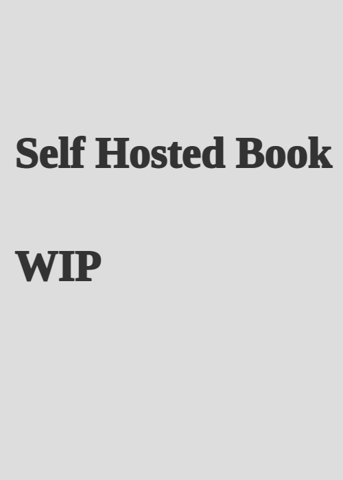

# The Self-Hosted Book

!!! note "WIP"

    This is a work in progress. The book is not yet finished.

{ width="20%" align=left }

This book is the fastest way to get up and running as a beginner with self-hosting your own applications on your server or NAS.

You still have to do the hard work of setting up your server and installing the applications.
But you will know what to look out for and get tips and tricks from an experienced self-hosting enthusiast who build a career out of this passion.
By the time you're done, you'll have your desired self-hosted applications running for yourself.

<!-- [Learn more](#about-the-book){ .md-button }  -->
[Subscribe to get updates](https://ajfriesen.com/#/portal){ .md-button .md-button--primary }

 

---

## About the Book

This book is for aspiring self-hosters who want to learn how to host their own services on their own server or NAS.
Like with everything new you will need to learn a lot.
This book will help you to get started with your self-hosting journey.

This is not a step-by-step guide.
This is an opinionated guide with recommendations on how to get started with self-hosting.
Kind of when writing a small `hello, world!` program in a new programming language.
This is the `hello, world!` of self-hosting. 

1. Preface
2. Introduction
3. Hardware
4. Operating Systems
5. Network Basics
6. Useful Linux Commands
7. File Systems
8. Memory
9. Finding logs
10. Network debugging
11. Recovery
12. Backup
13. Installing applications
14. Advanced Networking
15. Basic security 

---

## About the Author

{ width="15%" align=left }

Hey there 👋

I am Andrej Friesen, the author of *The self-hosted book*.

I am a self-taught software and systems engineer and a self-hosting enthusiast.
I basically started my journey into self-hosting with a Raspberry Pi 1 (the OG version) and a 1.5TB hard drive in 2012.

Since then I have spend countless hours learning about self-hosting and building my own infrastructure.
Later I switched my career into IT infrastructure despite the fact that I was studying to become an engineer.
I am now working as a software and systems engineer at a cloud provider and build Platform as a Service solutions.
Working on offering different tools as a service like: Kubernetes, NFS, several databases, and many more.

I am thankful for the open source communities and tools which allowed me to learn and build my own career path into IT.
I am now giving back to the community by writing this book and sharing my knowledge with you.
